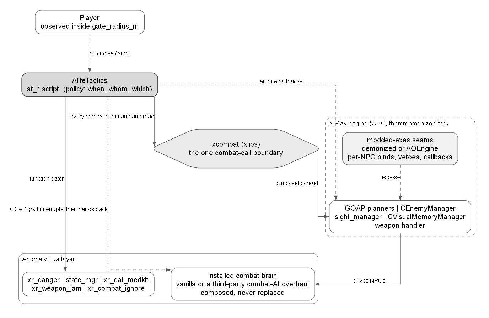
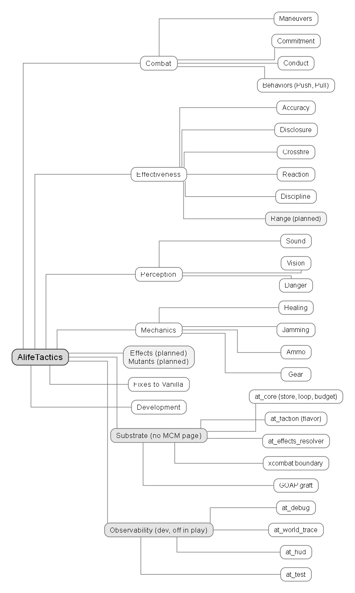
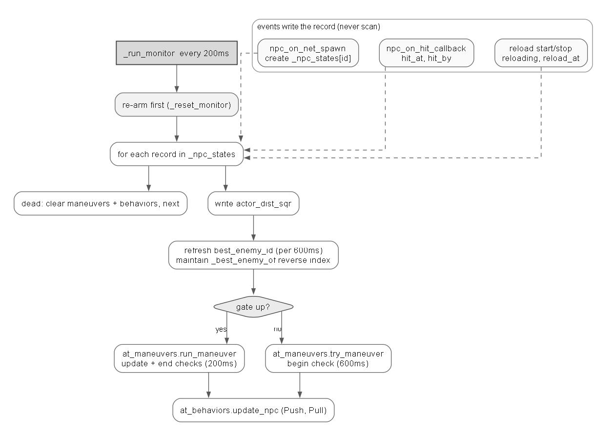
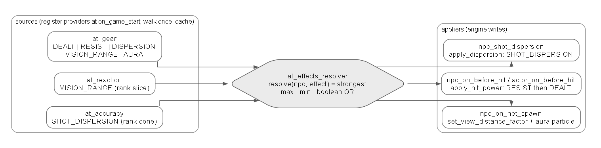
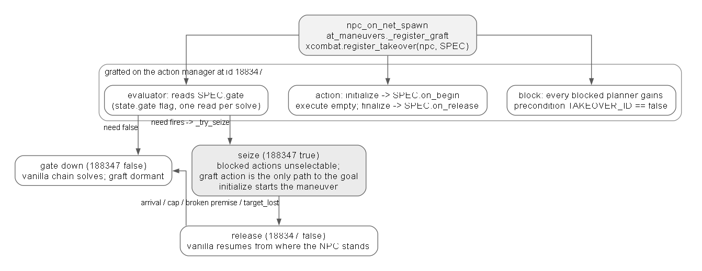
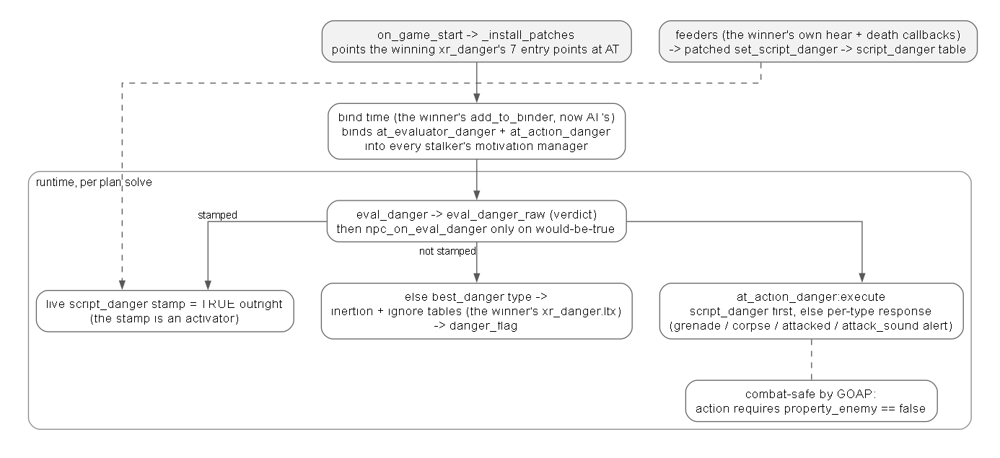

# AlifeTactics Architecture

AlifeTactics makes STALKER Anomaly enemies fight smarter.
Every system reads the real state of a fight, the combatants, their weapons, range, angle, cover, squad, and faction, then decides in the combatant's favour.
No scripted sequence and no die roll stands in for that read.

AT attaches to engine seams and composes.
It ships no replacement for a vanilla script file, so it runs under whatever combat brain a modpack installs, vanilla or a third-party combat-AI overhaul.
The Maneuvers takeover is the one system that imposes.
It borrows one NPC for one time-boxed maneuver and hands him back.

AlifeTactics owns the combat axis of a family of A-Life mods.
It builds on the xlibs base library (xcombat, xsquad, xcreature, xttltable, xtime, xprofiler, xlog, xmcm, xinventory, xsmart, xmath).



## Container: the MCM system tree

The user-facing containers are the MCM tree (`at_mcm.script`).
Every other document follows its grouping, order, and names.
The Substrate and Observability containers carry no MCM page.



- Combat: Maneuvers, Commitment, Conduct, Behaviors (Push and Pull).
- Effectiveness: Accuracy, Crossfire, Reaction, Discipline, Range (planned).
- Perception: Sound, Vision, Danger.
- Mechanics: Healing, Jamming, Ammo, Gear.
- Effects (planned), Mutants (planned).
- Fixes to Vanilla: the always-on repairs, shown as locked toggles.
- Development: log level, World trace, debug HUD, reset.
- Substrate (no page): at_core, at_faction, at_effects_resolver, the xcombat boundary, the GOAP graft.
- Observability (dev, off in play): at_debug, at_world_trace, at_hud, at_test.

## Control model

One loop drives combat.
Every other system reacts to a discrete engine event or plants standing per-NPC state the engine reads on its own.
No work runs per frame.

The combat loop is `at_core._run_monitor`, a vanilla time event at 200ms (`at_core.script`).
It registers from `actor_on_first_update` and re-arms after a save load, because time events do not survive a load.
It costs one due-time compare per frame inside `ProcessEventQueue`.
It arms only while Combat, Push, or Pull is enabled, and all three off stops it (`at_core.script`).



```
_run_monitor every 200ms (at_core.script):
  re-arm first (_reset_monitor)          ProcessEventQueue has no error guard, so a re-armed pass costs one aborted tick
  for each record in _npc_states:
    dead      -> at_maneuvers.clear_npc + at_behaviors.clear_npc, next
    write actor_dist_sqr
    refresh best_enemy_id (per 600ms) and the _best_enemy_of reverse index
    gate up   -> at_maneuvers.run_maneuver   (update + end checks, 200ms)
    gate down -> at_maneuvers.try_maneuver   (begin check, 600ms)
    always    -> at_behaviors.update_npc     (Push, Pull)
```

The service loops run beside it, each inert until its feature needs it.

```
loop                        owner and cadence            walks
at_ammo._run_monitor        at_ammo.script, 5s           the spawn roster: the AP box-decay tick
at_healing._run_monitor     at_healing.script, 200ms     the spawn roster: the limp pose and its drop detectors
at_sound._run_pass          at_sound.script, 500ms       online stalkers inside the accumulated step radius
at_world_trace monitors     at_world_trace.script, 150ms + 60ms   near-actor NPCs, registered only while World trace is on
at_hud._update_hud          at_hud.script, 500ms         the capped visible rows, debug HUD only
```

The per-event systems hold no loop.
Their cadence is the engine callback the engine already fires.
Commitment runs on the action-switch and cover-repick vetoes, Conduct on the body-state and combat-distance asks, Accuracy on the per-shot dispersion callback.

## Data and ownership

There is one store and one pass.
`_npc_states[id]` (`at_core.script`) holds one record per tracked stalker, created on `npc_on_net_spawn` and deleted in one teardown sequence.
Every field has one writer.

```
_npc_states[id] field         writer                    meaning
id, ran_at{}                  at_core (spawn)           identity, the per-check clocks
hit_at, hit_by                at_core (hit)             the last landed hit: time and shooter id
reloading, reload_at          at_core (reload edges)    the PR #611 reload window
actor_dist_sqr                the loop                  squared distance to the player, once per pass
best_enemy_id, best_enemy_at  the loop                  the engine selection fact, refreshed per 600ms
gate, maneuver, dest, enemy_id  at_maneuvers            the takeover gate, open row, destination, committed target
push_*, pull*                 at_behaviors              the open press and pull windows
```

The reverse index `_best_enemy_of` (`at_core.script`) maps a target id to the set of NPCs holding it as best enemy.
The loop is the only writer of both directions.
Callers read candidates from `get_threats`.
The reader verifies every predicate live at its decision, so a stale entry costs one failed compare.

The start budget is one sliding-window counter (`_starts`, an xttltable) split into `vs_player` and `vs_npc` buckets so neither class starves the other.
The default is 6 per 10s each (`at_maneuvers_config.ltx [at_core]`).
Only a start spends: a maneuver grant, a first press, a pull open.
Re-applies and engine re-grants never count.

### The API

Systems read the substrate through `at_core`'s publics (`at_core.script`):

```
check_start(bucket) -> bool             room in the bucket's window
add_start(bucket)                       spend one start
can_start() -> bool                     either bucket still admits a start (the cheap pre-walk bail)
get_combat_record(id) -> record|nil     the per-stalker record
get_combat_records() -> store           read-only, for walkers (the HUD)
get_best_enemy(id) -> id|nil            the selection fact
get_threats(id) -> bucket|nil           the reverse-index candidates
has_recent_hit(state, now, ms) -> bool  hit_at inside the caller's window
is_enemy_vulnerable(enemy) -> bool[,term]  the one vulnerability rule, branched per kind
is_in_gate(state) -> bool               actor_dist_sqr against the one gate radius
```

`is_enemy_vulnerable` (`at_core.script`) answers whether an enemy can return fire now, branched per kind.
The actor answers on the weapon block terms (`xcombat.get_block_reason`: unarmed, reloading, empty magazine) plus sprinting and climbing.
A stalker answers on the block terms plus a playing animation (`xcombat.is_body_busy`).
A mutant never answers.
Every term reads objective state and no threshold enters the rule.
Commitment's LIQUIDATE, the Push press, and a future maneuver all read this one rule.

`is_in_gate` compares `actor_dist_sqr` against `gate_radius_m` (150 default, the sniper band maximum).
The combat systems' scope and the HUD's display set read the same fact through the same public.

Every combat command and read crosses the xcombat boundary (see Substrate).
AT owns policy.
xcombat owns mechanism.

## Integration model

Each system reaches the combat brain through one method.
The methods order by how much of the engine's decision chain each displaces.

```
grip     method            AT systems                              what it does
strong   forced action     Maneuvers                               grafts an evaluator+action at TAKEOVER_ID 188347 and
         (takeover)                                                 precondition-blocks the vanilla chain, holds one NPC for seconds, then releases
         engine-hook veto  Commitment                              answers allow or deny before the engine commits one decision
         per-NPC bind      Reaction, Vision, Discipline,               plants standing per-NPC state the engine consults with no Lua on the hot path
                           Gear, Ammo, the move hold, the Push fire
         callback adjust   Accuracy, Crossfire, Conduct, Push band, Pull,   scales or answers one per-event value inside an engine callback
                           the effects resolver
         function patch    Danger, Healing, Jamming                 replaces one anomaly-layer module function in place
weak     squad simulate    the flee holster re-assert              lays a state overlay on a driven NPC, no planner touched
```

A demonized seam probes at load with `type(fn) == "function"`.
It goes inert on a floor exe with one INACTIVE log line, so a bind and a callback each have vanilla and above-floor members.
Where Lua cannot reach a C++ decision point, the seam is added to the demonized build first and consumed second.
The consumed seams are the action switch (PR #595), the cover re-pick (PR #607), the reload edges (PR #611), and the combat-distance asks (#563).
The rest are the aim params (PR #594), the fire-queue scale (PR #603), the hit redirect (PR #636), and the visible-enemy bias (PR #637).

## Invariants

Every system holds all of these.
A change that breaks one is wrong even when it works.

- Performance first. Only correctness and never-break-base-gameplay outrank it. A feature that cannot meet the budget is reworked, dropped, or handed to an engine PR.
- The 2ms ceiling. Every measured flow targets 0.1ms average per call with a 2ms hard ceiling, an eighth of a 60fps frame. Cold start, save load, and level transition count.
- The 20v20 bound. The monitor pass at `at_test.start_arena(40)` averages 0.1ms to 0.4ms under a 4ms ceiling. 50v50 is not a test scale, because Anomaly malfunctions near 100 combatants.
- No per-frame work. Ongoing work runs on a scheduled time event or a discrete engine event. Dispatch in front of a throttle is per-frame work.
- No file overrides. Every system attaches by a callback, a function patch, a DLTX overlay, a scheme patch, or the time-boxed takeover.
- Engine truth. Every mechanism claim carries an engine source cite. Where the engine had no seam, the seam was added upstream first.
- The xcombat boundary. Every NPC combat command and read goes through an xcombat primitive.
- Debug is free when off. Every trace gates on one integer compare (`at_debug.is_on()`), and the timers are null objects, so measurement costs nothing live.
- Every vanilla or xray fix appears on three surfaces: readme.txt under Fixes to Vanilla, the changelog as a Fixed vanilla bug line, and the MCM Fixes tab.

## Substrate

The substrate carries no user surface.
at_core is above (Control model, Data and ownership).
Faction flavour, the effects resolver, the xcombat boundary, and the GOAP graft follow.

### Faction flavor

Does: decides whether a behaviour triggers for this NPC before the behaviour's own mechanics run, the flavour-first law.
Changes: a per-NPC boolean held for the fight, nothing in the world.
Stops: a zombied NPC carries 0 on every participation key, so no maneuver, veto, or press reaches him.

```
has_flavor(npc, key) (at_faction.script):
  chance = get_faction_chance(community, key)   [<faction>] key, else [default], else 1
  chance >= 1 -> true    chance <= 0 -> false   (no roll)
  else roll once per NPC per key, hold the boolean 300s in an xttltable
```

The roll holds 300s so a stalker either carries a behaviour for the whole fight or does not.
The TTL avoids policing the fight edge, which flickers across lulls.
The character lives in `at_faction_config.ltx`, all user-set.
The militarized factions hold posture and never rout, the flee-prone run first, the aggressive factions press.
Zombied carry 0 on every key, so the file is the zombied participation filter.

### Effects resolver

Does: combines a per-NPC value more than one source feeds, and owns its engine write.
Changes: `set_view_distance_factor` and the aura at spawn, hit power on before-hit, dispersion on the shot seam.
Stops: a value only one source feeds never enters resolve, it stays in its owning module.



```
register(effect, fn)                    a source adds a provider (at_effects_resolver.script)
resolve(npc, effect)                    the strongest contribution across providers
                                        max, min for a reduction, boolean OR for the aura
```

```
effect           combine   sources
DAMAGE_DEALT     max       at_gear: electro and the quest-special classes
DAMAGE_RESIST    min       at_gear: gravi, ballistic plates, the chemical interim
SHOT_DISPERSION  min       at_accuracy: the rank cone; at_gear: thermal
VISION_RANGE     max       at_reaction: the rank slice; at_gear: binoculars by day, NVG by night
AURA             OR        at_gear: every artefact class
```

Each combine mode matches the effect's meaning, min for a reduction (the strongest cut), max for a boost (the strongest gain), OR for the aura (a presence).
Each provider walks the NPC once on first call and caches in its own module.
`resolve` then re-combines cached answers, a table read plus a max or min.
The `net_spawn` applier is the first caller, so the walk lands there, never inside a hit or shot callback.
The aura particle attaches at spawn on the configured bone or the first fallback the skeleton accepts, and dies with the game object.
There is no stop path, because `stop_particles` trips the engine bone assert on a non-renderable bone (observed live).

`at_compat.script` quarantines the one foreign coupling.
grok_bo (a foreign hit pipeline) recomputes and self-applies player-to-NPC hit damage, discarding the resolver's DAMAGE_RESIST.
The wrapper installs at `actor_on_first_update` after every other grok_bo wrap is in place.
It measures the health delta grok_bo dealt and heals back the resisted fraction (`at_compat.script`).
It is inert without grok_bo.

### xcombat boundary

Does: issues every AT combat command and read to the engine through one primitive per call.
Changes: weapon state, aim, movement, cover search, the cover reservation, and the takeover.
Reads: line of fire, sight, memory, arrival, and enemy state.
Stops: it holds no live-event callback and no ownership table of its own, so it stays stateless.

AT owns policy: when, whom, which maneuver.
xcombat owns the mechanism of reaching the engine.
The full primitive surface is xlibs' own architecture doc.

### GOAP graft

Does: gives the takeover a control point, so while the gate is up the solver can finish only through AT's one action.
Changes: it adds an evaluator, an action, and a block precondition to every stalker's motivation manager at spawn.
Stops: a companion is excluded while `combat_ignore_companions` is on, so no dead graft parks on his manager.



```
npc_on_net_spawn -> at_maneuvers._register_graft -> xgraft.register_takeover(npc, SPEC)
  SPEC.gate      -> the graft evaluator reads state.gate, one flag read per plan solve
  SPEC.on_begin  -> _start_maneuver   SPEC.on_release -> _on_release
grafted at TAKEOVER_ID 188347 (xgraft.register_takeover), every blocked planner gains precondition 188347 == false

gate down   188347 false   the vanilla chain solves as always, the graft sits dormant
seize       188347 true    every blocked action is unselectable, the graft action is the only path to the goal, initialize starts the maneuver
release     188347 false   vanilla resumes from wherever the NPC stands
```

On seize:

- `initialize`: clear animations -> set path, direction, danger mental state -> register in combat -> `SPEC.on_begin`
- `apply_takeover_block`: blocks vanilla combat, danger, and cover, plus the monolith, zombied, camper, and facer sub-schemes (`xgraft.get_blocked_planners`)
- per-NPC by construction: a duplicate world-property add on one action throws (`condition_state_inline.h`), so it re-runs each seize to catch an action a later `configure_schemes` bound

The reserved id 188347 (`xgraft.register_takeover`):

- moved off 188200 after a companion mod's shelter scheme collided
- Maneuvers outranks behaviors and Commitment
- vanilla ids only, so a seized NPC proposes no switch and the action-switch veto never fires

## Combat

Maneuvers imposes.
Commitment, Conduct, and Behaviors compose.

Three Lua mechanisms in the Anomaly ecosystem can take the fight from the engine's combat planner, and they differ only in how the ownership is bounded.
A combat sub-scheme (the monolith and zombied brains) owns every fight of its NPCs and must therefore be a total combat brain.
Whatever it leaves out, its NPC never does.
A combat-moment scheme (rx_ff, xrs_kill_wounded) interjects one behavior mid-fight, bounded by its evaluator's condition alone, and a stuck condition holds the NPC for as long as it lies.
The takeover bounds by condition and clock both.
One committed transaction runs for seconds, ends on arrival, a broken premise, or the cap, and the engine fight resumes with cover, flanking, and retreat intact.
The engine brain keeps everything an NPC should keep doing well.
The graft borrows only what no parameter, veto, or seam can express, and gives it back.

The maneuvers, the Push, and the Pull share one scope.
They open only inside `gate_radius_m` of the player (`at_core.is_in_gate`), only on a human target (`IsStalker` on the selection, `at_maneuvers.script`), and never on a zombied NPC.
Fights against mutants and fights past the gate stay vanilla.
No system walks NPC pairs.
Every scan reads the NPC's own record.

### Maneuvers

Does: launches one committed behaviour vanilla lacks or must be forced into, then hands the NPC back. AT stays an interrupt over vanilla and never becomes the combat brain.
Changes: it seizes one NPC through the GOAP graft, sets his destination, fire intent, posture, and movement once, and re-applies on the update check.
Stops: at most one open maneuver per NPC, bounded by the start budget, ended on arrival, a cap, or a broken premise, cleaned up on death and despawn.

```
begin check (600ms, _try_begin_maneuver at_maneuvers.script):
  fighting? (live best_enemy or a hit within hit_fight_ms), enemy is actor or stalker
  _check_seize_block: armed, outside smart cover, no playing animation, budget left
  _resolve_maneuver: walk the catalog from a per-NPC cursor
    per row: scope -> toggle -> flavor -> check_need -> palette -> find_destination
    first row whose need holds runs its find_destination (the one geometry probe) and ends the walk
  _try_seize: spend a start, apply_takeover_block, raise the gate, stamp row + dest + committed target
update check (200ms, _update_maneuver): re-apply the row's state, skip while reloading or a hit reaction plays
end check   (200ms, _try_end_maneuver): wounded, the row's check_end, arrival, or the cap, target_lost ends at once
```

From staging on, the maneuver is committed to that target:

- update and end resolve the staged id and never re-read best_enemy, so the look never re-targets mid-maneuver. A dead or despawned target ends it.
- fire intent lives in `xcombat.set_combat`. A reloading weapon degrades it to READY first, since a fire goal mid-reload cancels the engine reload.
- move hold (`xcombat.set_movement_hold`, PR #645) stops the engine mover sliding a standing NPC through a hit reaction
- the hold sets the frame the hit lands and releases when the reaction ends (`_update_hold`)

The burst shape patches `state_mgr_weapon.get_queue_params` (`_compute_queue_params`).
A maneuver rolls size and pause fresh per query inside the engine's own per-weapon medium band, then multiplies by the Discipline rank factors.
A non-maneuver NPC passes through byte-identical.
The catalog rows come from `at_maneuvers_config.script`, array order is priority:

```
maneuver      fires on                                   applies to               destination                      fire; move        ends on
counterflank  actor within 5m while the committed        any NPC fighting         holds its spot, aims at actor    FIRE; STILL       3s
              target is farther (check_actor_close)      someone else (vs_actor)
reload_cover  reloading, a watcher has him in sight      any (flavor)             nearest cover hiding him         READY; RUN        arrival, reload done, or 8s
flee          hurt, threat in reach, last man,           the flee-prone           a friendly base 100m+ away,      STOW; RUN         arrival or 20s
              once the shooting pauses (check_hurt)                               rear-biased
retreat       hurt, threat in reach (check_hurt)         the flee-prone fallback  cover behind, farther from enemy FIRE; WALK        arrival or 8s
kite          nearest threat inside MY weapon minimum    universal                a clear back-lane, weapon-set    FIRE; WALK        arrival or 8s
              (check_too_close)                                                   distance to the rear
pickoff       stalled ~4s, past the enemy's effective    the disciplined          holds its spot                   single shots; STILL  8s or premise broken
              range, unbothered (check_stalled)
```

The discriminator is displacement.
A pick of the same situation with the NPC still within 2m past `repeat_limit` (3) means the last transaction changed nothing, so the takeover refuses and vanilla owns him (`_check_repeat_limit`).
A legitimate chain under a sprinting player re-fires at once, and each transaction moved him, which resets the count.

### Commitment

Does: holds a stalker on a winning fire action instead of letting vanilla break contact to shuffle toward marginally better cover.
Changes: it answers deny on a proposed action switch or cover re-pick. It writes nothing to the planner.
Stops: nothing seizes and no maneuver launches. Every non-fire transition passes.

```
npc_on_combat_action_switch (PR #595, via xcombat.on_action_switch) -> _on_action_switch sets flags.allow = false (at_commitment.script)
  kill_enemy / kill_if_not_visible -> take_cover : sees enemy (visible_now, stalker_combat_actions.cpp) + lane clear (can_kill_member) + fire_make_sense
  kill_enemy -> get_ready_to_kill               : the same sight gate
  detour_enemy -> take_cover                     : held while blind, released on re-sight
npc_on_best_cover_repick (PR #607, via xcombat.on_cover_repick) -> _on_cover_repick denies the swap that clears InCover
```

- every gate falsifies itself, so release needs no machinery
- `kill_enemy` (`stalker_combat_planner.cpp`) requires `InCover`, and a best-cover re-pick clears it before the exit is proposed, so holding the cover keeps the exit unselectable
- the cap (`commitment_hold_s`) is a time-to-live on one continuous refusal, and an allowed switch resets it
- at the relent moment the veto consults `at_core.is_enemy_vulnerable` and defers up to VULNERABLE_EXTEND_MS (4000ms) while the enemy cannot answer, the LIQUIDATE deferral (`_try_extend_hold`)
- a seized NPC never reaches this seam, because his blocked planner runs no combat action

### Conduct

Does: two habits on vanilla-driven NPCs at moments the engine already decides, cover posture and weapon spacing.
Changes: it answers one per-event value inside the engine callback, the body-state or the combat-distance ask.
Stops: no takeover and no held actions. A maneuver-held NPC never reaches either callback.

```
npc_on_combat_set_body_state -> _on_combat_body_state (at_conduct.script)
  answers only hold_position (the one provably stationary op, stalker_combat_actions.cpp). long weapons, experienced+ tier, past 20m
  the decision is HELD, re-decided per DECIDE_MS (3s) by a crouch-eye shot ray (xcombat.has_shot_obstacle):
    crouch when the low line is clear, stand when a low wall would eat the shot
npc_on_get_min/max_combat_dist (#563, via xcombat.on_get_min/max_combat_dist) -> scale the engine's own band
  SMG tightened x0.6, sniper minimum raised by rank. the same handler answers the Push cap and the Pull band as overlays
```

- every handler scales the handed base and never replaces it, so the engine's weapon-type semantics survive underneath
- the posture decision is held for the DECIDE_MS window, because the engine re-asks the body state several times a second
- the crouch-shot line flips between clear and blocked, so a stateless per-ask decision would flap crouch and stand
- a per-NPC disposition roll (`conduct_crouch` flavour) crouches only some eligible stalkers, so a firing line mixes standing and crouched shooters

### Behaviors: Push and Pull

Does: presses a stalker whose committed target cannot answer (Push), and falls back a stalker caught in his own weak moment while his target is strong (Pull).
Changes: Push bumps the fire queue (a per-NPC bind) and the cover band (through the Conduct handler). Pull raises the accepted cover minimum.
Stops: everything reverts within one pass when the cause clears. A seized NPC never presses or pulls.

```
at_core.update_npc -> at_behaviors.update_npc per record per pass (no seam of its own, scan-only)
Push (_update_push_npc at_behaviors.script): open in-gate on a human target
  press cause polled from the target: is_enemy_vulnerable under push_reload, or standing weak with hysteresis under push_finisher
  FIRE bump range-gated by the burst-tail law. BAND bump gated by target-facing advantage (bleeding, back turned, self healthy)
  first write spends one start, caps at push_window_max_ms, cools down on his own record
Pull (_try_open_pull / _update_pull_npc): my record shows reloading or hurt with a recent hit, my target strong, my faction rolls me in
  set_pull_band raises my accepted cover minimum so my re-picks land farther, held then cooled down
```

- Pull outranks Push per NPC, and both Conduct handlers apply the pull overlay after the push cap, so self-preservation wins over aggression
- every write is transition-only against the per-NPC mirrors, cleared on cause end, toggle-off, seize, death, despawn, and unregister

## Effectiveness

Per-NPC skill layers on vanilla-driven fire and perception.
Each reaches every NPC shot regardless of what drives it.
A maneuver changes who drives movement. The skill model still applies.
Reaction, Vision, and Discipline share one file (`at_reaction.script`).
`set_aim_params` writes aim, lock, and lead in one engine call, and one loader walks the rank curves once.

### Accuracy

Does: gives NPC dispersion a real per-rank curve, because the engine rank curve degenerates on Anomaly gamedata.
Changes: it scales the per-shot dispersion, the flat curve as a resolver provider, the moving-fire curve on the shot seam.
Stops: nothing when off. A shot passes through untouched.

```
register(SHOT_DISPERSION, _compute_disp)             the flat rank curve, min-combined with thermal (at_accuracy.script)
npc_shot_dispersion -> _on_move_penalty        scales while move_type <= run (walk or run), single-source and per-shot keyed
```

The engine rank knob is dead.
`Rank()` clamps to [0,100] (`ai_stalker.cpp`) while Anomaly rank intervals run to 26999.
Every NPC collapses to the one dispersion constant `m_fRankDisperison` (`ai_stalker_fire.cpp`).
The 16 per-tier values live in the at_mcm defaults table, and the script's `_disp` and `_move` tables fill at refresh, so no LTX or script copy can drift.

### Crossfire

Does: keeps same-faction NPCs from cutting each other down through the engine's imperfect avoidance.
Changes: it scales `shit.power` on a friendly hit.
Stops: genuinely hostile pairs trade full damage, and the actor as shooter is excluded.

```
npc_on_before_hit -> _on_before_hit (at_crossfire.script): O(1), no throttle, a damage block must catch every hit
  stalker vs stalker, actor excluded, has_flavor(crossfire)
  attacker is a real enemy (xcreature.is_enemy) -> full damage
  else shit.power = power * crossfire_factor
```

It keys on per-NPC relation, so a soured cross-faction pair still damages each other while allies stay safe.
Community never enters the decision.

### Reaction

Does: shapes gun handling per rank, aim tracking speed, tracking lock, and target lead, and binds the two always-on targeting fixes.
Changes: a per-NPC bind at spawn for aim, lock, and the two CEnemyManager selection levers, a live recompute on the fire seam for lead.
Stops: it stays under the max aim angle and never below the global baseline, so a player's difficulty choice is always kept.

```
npc_on_net_spawn -> apply (at_reaction.script):
  set_hit_redirect(TURN_MAX, TURN_FALLOFF_M)  (PR #636, enemy_manager.cpp)   the last attacker's cost drops up to 900, decaying to 0 at 60m
  set_visible_enemy_bias(selection_actor_bias, -1) (PR #637, enemy_manager.cpp)   the player magnet dial, 900 = vanilla, lower treats him like any combatant
  set_aim_params(npc, -1, track, aim, -1)  (PR #594)
  aim min_speed and track min_angle from the rank curve. _resolve_min_angle returns -1 when the global is already stickier
npc_shot_dispersion -> _on_shot_lead, throttled 1s: set_aim_params with a fresh predict_time
  predict = clamp(range / bullet_speed * rank_lead_factor, 0, 0.5) (predict_object_position, sight_action.cpp). bullet_speed reads the section and the loaded round's k
```

The targeting binds are vanilla-behavior fixes (the Fixes tab's sticky targeting and player bias), never behind the page toggles.
At 900/60 a close attacker outranks a fully-visible distant enemy, so a hit victim flips selection on the real hit signal.
`fire_make_sense` still requires line of sight, so nothing fires through cover, and a suppressed kill discloses nothing to anyone.

The tracking lock widens the band toward the fire cone (novice 0.196 to legend 0.40), so a legend holds a strafing target through the firing window while a novice's aim lags.
The per-rank lead factor (2.00 novice to 1.00 legend) is the only skill lever, so a legend leads true and low ranks over-lead a crossing target.
Aim and lock bind per NPC through `set_aim_params` (PR #594), the seam added so a rank curve can vary per NPC.

### Discipline

Does: scales burst size and cadence per rank; the shipped defaults are a near-flat band, so rank barely alters fire out of the box and the sliders carry the full spread.
Changes: a per-NPC fire-queue scale at spawn, plus the shared tier tables maneuver fire consumes.
Stops: defaults keep a rank's rounds per minute at or above vanilla, so a shorter burst sheds only the dispersed tail.

```
npc_on_net_spawn -> apply -> _apply_discipline (at_reaction.script): set_fire_queue_scale(npc, size_k, interval_k)  (PR #603)
  interval floored at 0.60 so bursts never merge into continuous fire
get_queue_scales(npc): the ONE owner of the tier tables, (1,1) when off, consumed by the maneuver burst shape and the push restore
```

Scope is vanilla-planner fire.
A state_mgr fire state (a maneuver override) reaches the object handler with explicit params, which is why maneuver fire multiplies the same factors through `get_queue_scales`.

### Range (planned)

The engine stops NPC fights at a hard range cap regardless of weapon, so a sniper never fires at the distances his rifle exists for.
This page will let long-range NPCs answer and initiate at their weapon's real reach.
The page is not built.

## Perception

Perception is sense and reaction, separate from combat skill.
Detection comes from Sound and Vision.
Danger owns the reaction scheme both stamp into.

### Sound

Does: lets hostile stalkers hear the player's movement and handling noise, and standing stalkers glance at heard creatures.
Changes: the actor's signals stamp `xr_danger.set_script_danger`, so their reaction, decay, and cleanup are the danger scheme's; a creature sound only refreshes the hearer's look target.
Stops: crouched movement is silent outright, neutral NPCs never react to the player's noise, no sound-only stamp produces a run state, and a creature sound never enters the danger scheme.

```
actor_on_footstep / actor_on_land -> accumulate a noise radius (at_sound.script)
  BASE_RADIUS_M (5m) x stance (crouch 0, sprint 1.6) x surface material x MCM mult x install-hearing scale
_run_pass (500ms) -> mask by rain, walk db.OnlineStalkers, stamp every hostile inside the radius (per-NPC throttle 4s)
npc_on_hear_callback -> _on_hear: the actor's reload/empty/item types stamp at the sound position;
  a creature MST_* sound (mutant always, a stalker source only when hostile to the hearer) -> _try_glance
_try_glance: standing, out of combat, throttled 8s -> a same-state look refresh at the sound position - no stamp, no scheme entry
```

The install-hearing scale reads the winning config's own stalker hearing sensitivity, so a setup that deafens NPC hearing quiets these sounds with it.
A stamp carries an evidence grade the danger scheme runs at.
FAINT turns a standing NPC weapon-ready toward the position, SOLID walks him over, and an unexpired stronger stamp survives a weaker one.
The glance is a state_mgr look refresh consumed before the same-state early-out, so it never preempts a scheme, never moves anyone, and skips a walking body outright.
Footsteps are never typed into the engine sound space.
A typed hostile footstep would flood the bounded sound-danger memory (`sound_memory_manager.cpp`), and the reaction is script-scoped.
Stealth in Anomaly is a vision system.
Sound never touches vision, seen-memory, or the sight test.

The Sound page also carries two gunfire reactions the patched danger scheme runs.
Enemy gunfire (`danger_attack_sound`) routes an attack_sound danger the NPC heard but cannot see to a face-the-sound threat stance (`at_danger.script`).
He moves to cover once he sees the shooter.
The engine raises the attack_sound danger and vanilla ships no handler, so AT supplies the missing reaction.
Neutral gunfire (`danger_neutral_gunfire`) puts a neutral or friendly stalker on alert to the player's shots within NEUTRAL_GUNFIRE_RADIUS_SQR (30m, `at_danger.script`).
The reaction is alert only and never turns hostile, scoped to the actor, so NPC-vs-NPC neutral fire stays ignored.

### Vision

Does: gives each rank a vision curve on two axes, acquisition speed and view range.
Changes: a per-NPC bind for speed (`set_vision_speed`), a resolver provider for range (`set_view_distance_factor`).
Stops: it is reaction timing, and it cannot defeat occlusion.

```
npc_on_net_spawn -> apply -> set_vision_speed(npc, factor)   the per-update increment to the detection accumulator (visual_memory_manager.cpp)
register(VISION_RANGE, _compute_vision_range)                the rank slice, max-combined with gear optics
```

The speed band centres on novice = vanilla and rises to legend 1.21, every tier at or above vanilla so no rank detects slower.
It stays modest, because vision speed accelerates confirmation on any sightline the ray already reaches, and a wide spread would fast-confirm through weakly-occluding foliage.
The accumulation formula carries no transparency term, so a high speed never makes an NPC see through cover.

### Danger

Does: layers bug fixes and toggleable improvements onto whichever xr_danger a modpack ships, so the scheme reacts proportionately to what a stalker perceives.
Changes: it points the winning xr_danger's entry points at its own versions at on_game_start and binds AT's evaluators and action.
Stops: it ships no xr_danger.script of its own, so it does not contest the MO2 slot. The winner's own hear and death feeders keep running.



```
on_game_start -> _install_patches (at_danger.script): points 7 entry points at AT
  setup_generic_scheme, add_to_binder, configure_actions, reset_generic_scheme, get_danger_time, set_script_danger, has_danger
bind time: add_to_binder (now AT's) binds at_evaluator_danger + at_action_danger into every stalker's motivation manager
per plan solve:
  eval_danger -> eval_danger_raw verdict, then npc_on_eval_danger only on a would-be-true verdict (a subscriber veto clears the inertion latch)
    live script_danger stamp = TRUE outright (the stamp is an activator)
    else best_danger type -> inertion and ignore tables (the winner's xr_danger.ltx) -> danger_flag
  at_action_danger:execute -> script_danger first, else per-type response (grenade / corpse / attacked / attack_sound alert)
  combat-safe by GOAP: the action requires property_enemy == false
```

- a heard sound buys attention in proportion to its evidence. FAINT turns a standing NPC (a walking one ignores it), SOLID walks over (raid), rush runs (companions only); a weaker stamp never overwrites a live stronger one
- the active theatre is time-boxed per episode to the alert machine's own stage-2 give-up band, then the NPC settles into a standing watch until the config inertion decays
- the squad stand-down gate (`_is_squad_engaged`) skips the theatre while any squadmate holds a live enemy, memoized 500ms per squad
- mid-battle bystanders no longer run noise choreography inside a live fight
- the install registers the monolith sub-scheme's four actions in `state_mgr.combat_action_ids`, which vanilla omits, so the omitted actions no longer cause the crouch-aim shuffle
- it patches three rx_ff members to fix the friendly-fire freeze, the over-hold, and the blocked-shot test that held fire for bodies in any direction or beyond the target

Two Perception/Danger toggles add improvements over the patched scheme, both default on:

- Distant hits (`danger_hit_bypass`) returns a hit-perceive danger true at any range, past the relation and combat-ignore gates.
  A landed hit is proof of range, so a stalker sniped from beyond the ignore distance still ducks.
- Player ranges (`danger_actor_tables`) reads the actor-specific inertion and ignore tables when the danger source is the actor.
  A liveness probe gates it (`_actor_tables_live`), so it stays inert unless the winning xr_danger carries its own DangerIgnoreActor rows.
  Some overhauls differentiate those rows, and vanilla ships identical copies.

The paired DLTX (`mod_xr_danger_at.ltx`) is delete-lines only.
It drops the dead perceive keys of the `danger_object` enum name collision (`danger_object.h`), where the perceive-type names hit/sound/visual share values 0/1/2 with danger types.
Every detection distance comes from whichever xr_danger.ltx won the slot.

## Mechanics

Systems that act on the object layer, below the combat decision.

### Healing

Does: gives an NPC active first aid, a heal-rate multiplier, an engaged pause, a per-rank medkit charge, and a limp and heal gesture.
Changes: it patches three xr_eat_medkit members at on_game_start, rolls the charge at spawn, and drives the limp pose on a 200ms monitor.
Stops: bleed staunching stays vanilla, and both animations play only within 50m of the actor. The simulation is never distance-gated.

```
on_game_start -> _register_heal_patch (at_healing.script): heal_hp, heal_bleed, consume_medkit
  _update_heal_hp: scale change_health by the multiplier. PAUSE (ResetTimeEvent) while engaged (a live enemy with the weapon out, or an enemy within 5m)
zzz_at_healing_patch: unregister vanilla xr_eat_medkit.on_register (the save-load charge re-roll bug)
mod_xr_eat_medkit_at.ltx: adds the medkits/bandages lists vanilla [plugin] omits, so the consumption loop iterates
_run_monitor (200ms): the limp pose, gated 1s (hurt, no enemy, calm, standing), dropped the moment its gait stops matching
```

A queued script animation suspends the engine's whole animation selection (`stalker_animation_manager_update.cpp`).
The limp pose must die the moment its gait stops matching, which is what the drop detectors do.
The patches install unconditionally, so an MCM flip applies on the next heal_hp firing with no restart.

### Jamming

Does: suppresses the modded-exes script-injected NPC misfire, so an NPC at full weapon condition does not misfire every few rounds.
Changes: it patches the misfire functor to return 0 while enabled.
Stops: with the toggle off it forwards to the original, and the actor's own weapon keeps its full vanilla misfire.

```
xr_weapon_jam.GetConditionMisfireProbability = _compute_misfire_chance (at_jam.script), read per shot at Weapon.cpp
  enabled -> 0    disabled -> _original(weapon, npc, base_value)
```

The install captures the original first and installs only when it is a real function.
An absent functor logs INACTIVE and the module stays inert (vanilla Anomaly or AOEngine).

### Ammo

Does: fires AP from a veteran-and-up NPC's own loose ammo, with one rank-and-rate-weighted box decay per fight, until he reverts to vanilla FMJ.
Changes: `wpn:set_ammo_type` re-keys what is fired, and an inventory box-delete spends it.
Stops: it goes inert when `g_ai_unlimited_ammo` is 0, because the engine then consumes real rounds and the box decay would double-consume.

```
_run_monitor (5s) -> update_npc (at_ammo.script): rank >= min_ap_rank, a live weapon, an AP class in the weapon
  combat tick: cache the AP index, hold m_ammoType = idx while AP is carried
  peace tick (best_enemy nil past peace_debounce_ms): roll _compute_decay_chance, release one AP box, set type 0 when empty
```

The budget is the inventory itself, no ledger.
A whole-box delete is permanent, because `try_advance_ammo` (`object_actions.cpp`) refills rounds inside surviving boxes but cannot recreate a deleted box.
Decay is per-engagement rather than per-shot, because no NPC fire callback exists.

### Gear

Does: gives an artefact one combat edge chosen by its anomaly class, scaled by the section's tier.
Changes: five resolver providers (DEALT, RESIST, DISPERSION, VISION_RANGE, AURA) plus the single-source passive regen it writes itself.
Stops: any single artefact tops out at 10% and never stacks. The strongest source wins.

```
on_game_start: register the five providers (at_gear.script)
first resolve per NPC: one inventory walk, keep the strongest strength per effect, cache the record
npc_on_item_take / _drop -> re-resolve a cached record. net_spawn -> write passive regen (n039 bind)
```

Detection is by exact vanilla section name from the class lists in `at_gear_config.ltx`, so an artefact from any mod works if listed.
Optics read day and night live at the provider, so a carrier's range tracks the clock without a polling pass.
Passive regen routes through `xcombat.set_health_restore_boost` when the n039 bind is present, else the chemical strength folds into the resist pool.
The loot and trade inventory floors own carrier persistence, and Gear only marks the carrier.

## Planned

- Effects: player-facing combat feedback, starting with concussion (tinnitus and blur).
- Mutants: the same combat treatment as stalkers.

Both carry a decided MCM category and no built system.

## Fixes to Vanilla

Every fix repairs a crash, misread, or dropped behaviour in the winning xr_danger or stock Anomaly.
Each appears as a locked or toggled entry on the MCM Fixes tab and reuses one quoted name across the readme, the changelog, and the MCM.

- Danger scheme crashes: the mutant-corpse time crash, the torn-down and nil-return evaluator crashes, the undefined-shooter hit corruption, the post-death evaluation.
- Danger scheme reads: the bd_types enum collision (three categories read the wrong range), the meters-vs-squared grenade gate, the per-evaluation condlist re-parse.
- Danger scheme state: the friendly-fire combat-stance freeze, the any-direction blocked-shot hold, the stale danger-transition animation, the cover-reservation wipe on finalize, the re-attack stale position.
- Corpse investigation: the despawn crash, the wrong-investigator selection, the cleared-vertex target, the pre-stage crash, the reused-id danger linger.
- Target selection: the shot-at stalker turns on his shooter, and NPCs no longer converge on the player far harder than on each other.
- Accuracy: a real per-rank curve replaces the flat clamp.
- Combat: no fire into the low cover he ducks behind, and fire over low cover, reading eye height not chest.
- Movement: a hit no longer slides a standing stalker, and a maneuver never starts on an animating body.
- Healing: the restored medkit and bandage lists, the bandage gesture waiting for stillness, the limp dropped in a fight, the heal freeze, the save-load charge re-roll suppressed.

## Observability

This is dev tooling, off in play.
It measures outputs, because an intent field reads as frozen whenever an animation plays, so a healthy vanilla NPC and a stuck one give identical reads.
Code tracing goes to `alifetactics.log`, world tracing to `alifetactics_world.log`.

- at_debug: one logger and the `is_on()` gate (one integer compare against DEBUG_LEVEL 5), the shared formatters, and the mod-wide log-level refresh. Every gameplay module traces at its own sites.
- at_world_trace: an outcome recorder over the shot and impact feeds, off until the toggle registers its callbacks.
  - The slide watchdog reports a body travelling while its movement type is not locomotion (SLIDE), or faster than the fastest stalker speed (FAST).
  - The naturalness checks flag combat that reads wrong (idle, glued, reload loop, ghost, blindfire, aim-off, blindspot; DECOUPLE - an out-of-combat locomoting body facing against its own travel, with the live stamp grade as the cause; GESTURE - a script animation locking a locomoting body into a glide).
  - The minute report carries the out-of-combat danger-scheme occupancy (OCC), the jumpiness of the calm population as one number.
  - The ballistics recorder writes per-minute per-tier hit tables split still and moving, per-driver hit rates, and the burst-length histogram.
- at_hud: two lines per NPC on one shared grid, AT-driven first then fighting then idle, capped with an overflow line. The row colour is the driving system.
  - The candidate pass reads only the record's own facts against the gate, and the expensive row build runs only for the capped visible set.
- at_test: console commands (`@export console`, run via `run_string`).
  - The `create_squad_*` family, `add_ap_ammo`, and `run_lab` seed only real world state, so every resolver channel fires on the real spawn path.
  - `start_arena(n)` maintains a constant fight of n/2 side-a against n/2 monolith.

## Engine write surface

AT feeds engine memory and state, then lets the engine run its own combat detection on what was written.
No system reimplements engine behaviour.

```
system         engine state written                                          key calls
Combat         a GOAP action graft at 188347, the block preconditions,       register_takeover, apply_takeover_block, set_destination,
               destination, fire/posture/movement, the movement hold         set_combat, set_movement_hold
Commitment     nothing, it denies a proposed switch or cover re-pick         the action-switch and cover-repick vetoes
Conduct        the body-state answer, the cover-band min/max answers         npc_on_combat_set_body_state, on_get_min/max_combat_dist
Behaviors      per-NPC fire-queue scales, the cover-band overlays            set_fire_queue_scale, at_conduct.set_push_max/set_pull_band
Accuracy       per-shot dispersion (move penalty direct, rank a source)      npc_shot_dispersion, at_effects_resolver.register
Reaction       per-NPC aim, vision speed, fire-queue scales, and the         set_aim_params, set_vision_speed, set_fire_queue_scale,
               targeting levers at spawn                                     set_hit_redirect, set_visible_enemy_bias
Crossfire      the incoming hit power on a friendly hit                      npc_on_before_hit (shit.power scale)
Danger         the danger evaluators and action on the winning binder        patches xr_danger's 7 entry points, the script_danger table
Healing        the NPC health and bleeding fields, the healing_charge var    change_health, bleeding =, se_save_var
Jamming        a module function on xr_weapon_jam                            xr_weapon_jam.GetConditionMisfireProbability
Ammo           the CWeapon m_ammoType field, a per-fight box delete          wpn:set_ammo_type, alife_release
Gear           five resolver providers plus the single regen bind           register, set_health_restore_boost
```

## File and config layout

```
AlifeTactics/gamedata/
  scripts/
    _at_manifest.script          identity (name, version, xlibs)
    _at_init.script              the dependency gate and compatibility floor
    at_mcm.script                the MCM tree and the one config-defaults source
    at_debug.script              the code-trace primitives (one logger, the on() gate)
    at_core.script               the store, the 200ms monitor, the start budget
    at_faction.script            faction flavour (get_faction_chance, has_flavor)
    at_maneuvers.script          the takeover lifecycle and the row methods
    at_maneuvers_config.script   the catalog rows (structure LTX cannot hold)
    at_commitment.script         the anti-shuffle veto
    at_conduct.script            cover posture and weapon spacing
    at_behaviors.script          Push and Pull
    at_accuracy.script           rank dispersion and moving-fire curves
    at_reaction.script           aim, lead, vision, discipline, the targeting levers (one file, four MCM pages)
    at_crossfire.script          the friendly-fire damage gate
    at_sound.script              movement and handling noise hearing
    at_danger.script             the danger-scheme function patch
    at_healing.script            active first aid
    zzz_at_healing_patch.script  the vanilla on_register re-roll suppressor
    at_jam.script                the modded-exes misfire suppressor
    at_ammo.script               NPC AP ammo simulation
    at_gear.script               the functional-inventory source
    at_effects_resolver.script   the multi-source effects substrate
    at_compat.script             the grok_bo hit-pipeline compatibility wrapper
    at_world_trace.script        the slide watchdog and ballistics recorder
    at_hud.script                the live debug HUD
    at_test.script               console test commands
  configs/
    ai_tweaks/                   the DLTX overlays (mod_xr_danger_at.ltx, mod_xr_eat_medkit_at.ltx)
    alifetactics/                the per-system numeric tunables (at_<system>_config.ltx)
    ui/ui_at_stats.xml           the debug-HUD layout
    text/eng,rus                 the MCM strings
  textures/                      the MCM banner
```

Each system pairs its files.
`at_<system>.script` holds the logic and `at_<system>_config.ltx` holds the numbers.
A `_config.script` exists only where LTX cannot hold the shape, as the maneuver catalog references methods.
The MCM defaults in `at_mcm.script` are the one source for the per-tier tables, so no LTX or script copy of those tables exists to drift.
The compatibility floor (`_at_init.script`) requires xlibs >= 1.8.5 and modded exes (demonized >= 20250908, or AOEngine), asserted at boot.
A feature that needs a post-baseline symbol probes for it and goes inert with an INACTIVE line when absent.

## See also

- xlibs: the xcombat primitive surface every method above is issued through.
- xray-monolith (themrdemonized): the GOAP planners, CEnemyManager, sight_manager, and the seams cited above.
- Vanilla Anomaly: the unpacked xr_danger, state_mgr, and xr_eat_medkit the function patches attach to.
